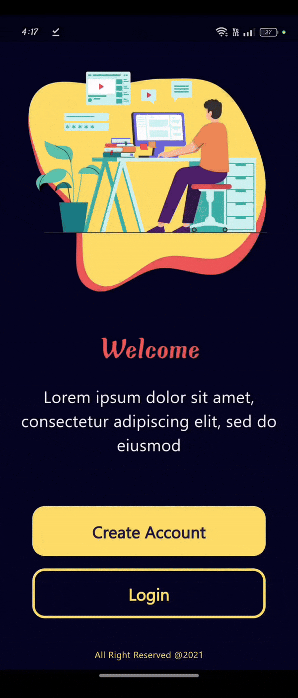

# Flutter Login and Registration Form UI

This project is a **sample Flutter application** that implements a clean and modern **login and registration form UI**. It is designed to showcase basic form validation, navigation, and bottom sheets for handling user registration and login in a mobile application. The UI is styled with a custom color palette are used to enhance the user experience.

## Figma Design

You can view the design of this application on [Figma](https://www.figma.com/design/ee5BDdOfyAmK6UVdKv6QQO/Login_Register-Form-(Community)?node-id=7-961&t=Oxzk2kp8pi5QZRfC-1).


## Demo

### UI Overview


### Form Validation



## Features

- **Welcome Screen**: The app opens with a welcome screen where users can choose to either create an account or log in.
- **Bottom Sheets**: Registration and login forms appear in bottom sheets for a seamless experience.
- **Form Validation**: Validation logic for email/username, course name, password strength, and password confirmation.
- **Custom Widgets**: Reusable form fields and buttons for a consistent UI/UX.

## Customization

- **Colors and Text Styles**: You can easily customize the color scheme or text styles by modifying the values in `AppStyle`.
- **Form Fields**: The form fields are implemented as custom widgets, making it easy to replace or extend them as needed.

## Project Structure

This project follows a modular structure, breaking down UI components into reusable widgets to keep the codebase clean and scalable.

### Key Widgets

#### `WelcomeView`

The **WelcomeView** is the starting point of the app. It includes buttons for creating an account and logging in, which trigger bottom sheets for respective forms.

```dart
class WelcomeView extends StatelessWidget {
  const WelcomeView({super.key});

  @override
  Widget build(BuildContext context) {
    return const Scaffold(
      backgroundColor: Color(0xff050522),
      body: SingleChildScrollView(
        child: Column(
          children: [
            WelcomeWidget(),
            SizedBox(
              height: 60,
            ),
            WelcomActionButtonWidget(),
            SizedBox(
              height: 36,
            ),
            Text(
              "All Right Reserved @2021",
              style: AppStyle.styleRegular11,
            )
          ],
        ),
      ),
    );
  }
}
```

#### `WelcomActionButtonWidget`

This widget houses the action buttons to create an account or log in, each opening a corresponding bottom sheet.

```dart
class WelcomActionButtonWidget extends StatelessWidget {
  const WelcomActionButtonWidget({super.key});

  @override
  Widget build(BuildContext context) {
    return Column(
      children: [
        CustomElevatedButtonWidget(
          buttonText: "Create Account",
          onPressed: () {
            viewBottomSheet(
                context, const CreateAccountBottomSheetBodyWidget());
          },
          backgroundColor: const Color(0xffFFDE69),
          textColor: const Color(0xff1B1A40),
        ),
        const SizedBox(
          height: 15,
        ),
        CustomElevatedButtonWidget(
          buttonText: "Login",
          onPressed: () {
            viewBottomSheet(context, const LoginBottomSheetBodyWidget());
          },
        )
      ],
    );
  }
}
```

#### `CreateAccountBottomSheetBodyWidget`

The **CreateAccountBottomSheetBodyWidget** Create Account bottom sheet layout includes a header, the registration form, and a footer with an option to switch to the login form.

```dart
class CreateAccountBottomSheetBodyWidget extends StatelessWidget {
  const CreateAccountBottomSheetBodyWidget({super.key});

  @override
  Widget build(BuildContext context) {
    return Padding(
      padding: MediaQuery.of(context).viewInsets,
      child: SingleChildScrollView(
        child: Column(
          children: [
            const SizedBox(
              height: 15,
            ),
            const BottomSheetHeaderWidget(
              massegeTitle: "Hello...",
              nameSubTitle: "Register",
            ),
            const SizedBox(
              height: 25,
            ),
            const Padding(
              padding: EdgeInsets.symmetric(horizontal: 12.0),
              child: CreateAccountFormWidget(),
            ),
            const SizedBox(
              height: 10,
            ),
            BottomSheetFooterWidget(
              messageText: "Already have account? ",
              actionText: "Login",
              onTap: () {
                Navigator.pop(context);
                viewBottomSheet(context, const LoginBottomSheetBodyWidget());
              },
            ),
            const SizedBox(
              height: 20,
            ),
          ],
        ),
      ),
    );
  }
}
```

#### `LoginBottomSheetBodyWidget`

The **LoginBottomSheetBodyWidget** Login bottom sheet layout includes a header, the Login form, and a footer with an option to switch to the login form.

```dart
class LoginBottomSheetBodyWidget extends StatelessWidget {
  const LoginBottomSheetBodyWidget({super.key});

  @override
  Widget build(BuildContext context) {
    return Padding(
      padding: MediaQuery.of(context).viewInsets,
      child: SingleChildScrollView(
        child: Column(
          children: [
            const SizedBox(
              height: 15,
            ),
            const BottomSheetHeaderWidget(
              massegeTitle: "Welcome Back!!!",
              nameSubTitle: "Login",
            ),
            const SizedBox(
              height: 25,
            ),
            const Padding(
              padding: EdgeInsets.symmetric(horizontal: 12.0),
              child: LoginFormWidget(),
            ),
            const SizedBox(
              height: 10,
            ),
            BottomSheetFooterWidget(
              messageText: "Don`t have an account? ",
              actionText: "Register",
              onTap: () {
                Navigator.pop(context);
                viewBottomSheet(
                    context, const CreateAccountBottomSheetBodyWidget());
              },
            ),
            const SizedBox(
              height: 20,
            ),
          ],
        ),
      ),
    );
  }
}
```

## Getting Started

### Prerequisites

- [Flutter SDK](https://flutter.dev/docs/get-started/install)
- A code editor such as [VS Code](https://code.visualstudio.com/) or [Android Studio](https://developer.android.com/studio)

### Installation

1. **Clone the repository**:
   ```bash
   git clone https://github.com/AdhamElagaty/login_register_form_ui.git
   cd login_register_form_ui
   ```

2. **Install dependencies**:
   ```bash
   flutter pub get
   ```

3. **Run the app**:
   ```bash
   flutter run
   ```

---
